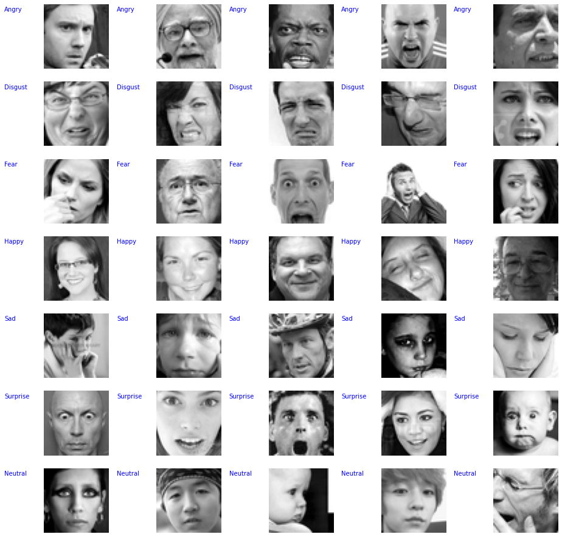

# Recognition of Facial Expressions 

## Introduction 

Facial expression is the most universal, natural, and powerful signal for human beings to convey their thoughts. Emotions don’t have a concrete definition, yet they drive every other decision made in our lives. 

A substantial amount of research has been done in the area. *Lit review* 

For our project, we are using [Facial Image Recognition Dataset (FER2013)](https://www.kaggle.com/c/challenges-in-representation-learning-facial-expression-recognition-challenge/data) – an open-source dataset containing approximately 30 thousand labelled 48x48 pixel grayscale images of faces. This dataset was published during the International Conference on Machine Learning (ICML). The emotions in the images belong to the seven categories - anger, disgust, fear, happy, sad, surprise, and neutral.

 
## Problem Definition 

Market research has proven that predicting sentiments correctly can be a huge source of growth for businesses, as it could help to gauge customer mood towards their brand or product. In addition to marketing and advertising, recognizing facial emotions is also important in various other fields – surveillance and law enforcement, video game testing, driving safety in cars, etc.  

We aim to create deep-learning based models that can classify human emotions.  

## Methods 

We will be using proven convolutional neural network architectures for image classification. We plan to consider a few candidate models: 
* Simple 2-3 layer ConvNet,  
* ResNet variants: 18, 34, 50, 101 
* DenseNet 

In addition to the different Neural network architectures, we also plan to perform:
* Image Augmentation: To improve generalization accuracies of the models  
* Learning Rate Finding & Scheduling: To get optimal learning rate for different stages of training the models 
* Transfer Learning: To utilize the feature representation from the same models trained on larger datasets 
* Visualization of activations and kernels: To understand feature representations of different emotions and the learned kernels. 

## Potential Results and Discussion 

Metrics to be considered –
* Accuracy, Precision, Recall, F-Beta Score
* Evaluation of models’ performances using Top-k Accuracy & confusion matrix.  
* Evaluation of Incorrect predictions: To analyze which emotion classes are hard to tell apart by the models 

Challenges in emotion recognition –  
* Different people can interpret emotions in different ways, and hence the training of the model (training data) may not be 100% reliable. 
* It is very tough to detect all possible cues for an emotion, and some cues can be common among different emotions. e.g., Visual cues like furrowed eyebrows can mean something aside from anger, and other non-so-obvious facial cues may be subtle hints of anger. 
* Bias based on race, gender, and age. 
 
## References

1) [Huang, Gao, Zhuang Liu, Laurens Van Der Maaten, and Kilian Q. Weinberger. "Densely connected convolutional networks." In Proceedings of the IEEE conference on computer vision and pattern recognition, pp. 4700-4708. 2017](https://arxiv.org/abs/1608.06993)

2) [He, Kaiming, Xiangyu Zhang, Shaoqing Ren, and Jian Sun. "Deep residual learning for image recognition." In Proceedings of the IEEE conference on computer vision and pattern recognition, pp. 770-778. 2016](https://ieeexplore.ieee.org/document/7780459)

3) [Wafa Mellouk, Wahida Handouzi. “Facial emotion recognition using deep learning: review and insights.” Procedia Computer Science, Volume 175, pp. 689-694, 2020](https://www.sciencedirect.com/science/article/pii/S1877050920318019)
