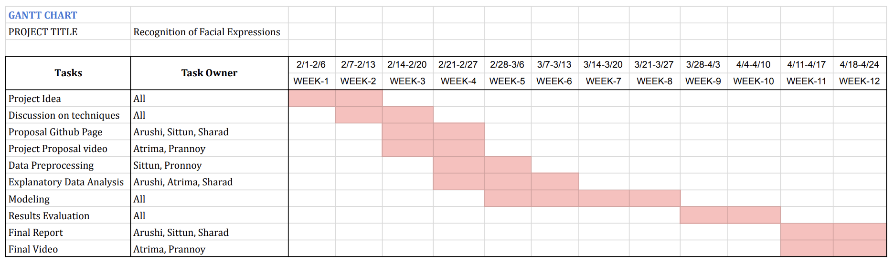

# Recognition of Facial Expressions
 
## Introduction 

Facial expression is the most universal, natural, and powerful signal for human beings to convey their thoughts. Emotions don’t have a concrete definition, yet they drive every other decision made in our lives. 

Our project focuses on recognition of facial expressions. We are using [Facial Image Recognition Dataset (FER2013)](https://www.kaggle.com/c/challenges-in-representation-learning-facial-expression-recognition-challenge/data) – an open-source dataset containing approximately 30 thousand labelled 48x48 pixel grayscale images of faces. This dataset was published during the International Conference on Machine Learning (ICML). The emotions in the images belong to the seven categories - anger, disgust, fear, happy, sad, surprise, and neutral.

 
## Problem Definition 

Market research has proven that predicting sentiments correctly can be a huge source of growth for businesses, as it could help to gauge customer mood towards their brand or product. In addition to marketing and advertising, recognizing facial emotions is also important in various other fields – surveillance and law enforcement, video game testing, driving safety in cars, etc.  

We aim to create deep-learning based models that can classify human emotions.

## Literature Review

The depth of representations is of central importance for many visual recognition tasks. However, training Deep neural networks is difficult. The two widely used models to overcome these limitations are ResNets and DenseNet. ResNets use skip connections from initial layers to later ones to reformulate the layers as learning residual functions with reference to the layer inputs and thus ease the training of substantially deep networks[2]. Dense Convolutional Network (DenseNet), connects each layer to every other layer in a feed-forward fashion and help alleviate the vanishing-gradient problem, strengthen feature propagation, encourage feature reuse, and substantially reduce the number of parameters[1]. Different CNN architectures and CNN-LSTMs for accurate detection of human emotions have been explored in literature.[3]

## Methods 

### EDA (Exploratory Data Analysis): 

The data obtained from [Facial Image Recognition Dataset (FER2013)](https://www.kaggle.com/c/challenges-in-representation-learning-facial-expression-recognition-challenge/data) consists of 48x48 pixel grayscale images of faces. The face is alomst centered and occupies about the same amount of space in each image. Furthermore, all the images in the training dataset are all clearly labeled with the distinct emotions they represent. 

We are using around 30K images for training our models, while 3.5K images for both validating and testing the results. On studing the distribution of images into the corresponding classes, we observed that the data is unbalanced. Out of the seven classes we have, 'Happy' emotion makes upto 25% while 'Disgust' is just 1.5% of the entire dataset. However, this distribution is similar for training, validation and test dataset. 

 

 Fig.2: Class Distribution 

 

 Fig.3: Average face by emotion 

  

 Fig.4: Eigen face by emotion 

We will be using proven convolutional neural network architectures for image classification. We plan to consider a few candidate models: 
* Vanilla Convolutional Neural Network
* ResNet variants: 18, 34, 50, 101 
* DenseNet 

In addition to the different Neural network architectures, we also plan to perform:
* Image Augmentation: To improve generalization accuracies of the models  
* Learning Rate Finding & Scheduling: To get optimal learning rate for different stages of training the models 
* Transfer Learning: To utilize the feature representation from the same models trained on larger datasets 
* Visualization of activations and kernels: To understand feature representations of different emotions and the learned kernels. 

## Results and Discussion 

Metrics to be considered:
* Accuracy, Precision, Recall, F-Beta Score
* Evaluation of models’ performances using Top-k Accuracy & confusion matrix.  
* Evaluation of incorrect predictions: To analyze which emotion classes are hard to tell apart by the models 

Challenges in emotion recognition:
* Different people can interpret emotions in different ways, and hence the training data may not be 100% reliable. 
* It is very tough to detect all possible cues for an emotion, and some cues can be common among different emotions. e.g., Visual cues like furrowed eyebrows can mean something aside from anger, and other non-so-obvious facial cues may be subtle hints of anger. 
* Bias based on race, gender, and age. 

## Timeline and Responsibilities

## References

1) [Huang, Gao, Zhuang Liu, Laurens Van Der Maaten, and Kilian Q. Weinberger. "Densely connected convolutional networks." In Proceedings of the IEEE conference on computer vision and pattern recognition, pp. 4700-4708. 2017](https://arxiv.org/abs/1608.06993)

2) [He, Kaiming, Xiangyu Zhang, Shaoqing Ren, and Jian Sun. "Deep residual learning for image recognition." In Proceedings of the IEEE conference on computer vision and pattern recognition, pp. 770-778. 2016](https://ieeexplore.ieee.org/document/7780459)

3) [Wafa Mellouk, Wahida Handouzi. “Facial emotion recognition using deep learning: review and insights.” Procedia Computer Science, Volume 175, pp. 689-694, 2020](https://www.sciencedirect.com/science/article/pii/S1877050920318019)
